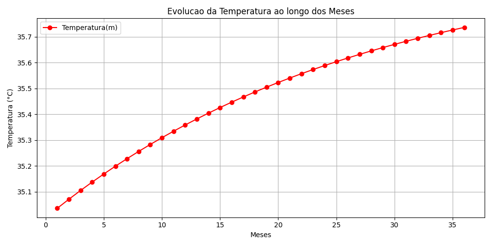
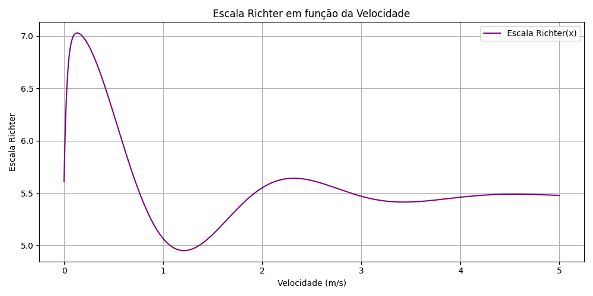

# 🌍 Projeto ClimaTempo: Modelagem de Fenômenos Naturais

## 🔍 Introdução

Este projeto tem como objetivo modelar dois fenômenos naturais com base nos dados fornecidos pela empresa **ClimaTempo**:

- **Movimentos anômalos da Terra**, representados pela Escala Richter em função da velocidade (em m/s).
- **Onda de calor**, descrita por uma função matemática em relação ao tempo (em meses).

Além disso, o trabalho busca:
- Gerar gráficos claros e informativos.
- Determinar os pontos máximos e mínimos de cada função.
- Apresentar os resultados de forma estruturada e compreensível.

---

## 🛠️ Tecnologias Utilizadas

O projeto foi desenvolvido utilizando a linguagem **Python** e as seguintes bibliotecas:

| Biblioteca   | Finalidade |
|--------------|------------|
| **Pandas**   | Armazenamento e análise de dados. |
| **Matplotlib** | Visualização de gráficos. |
| **NumPy**    | Cálculos matemáticos complexos. |

---

## 📈 Funções Implementadas

### 1. Temperatura em função do tempo - `T(t)`

- Intervalo estudado: `t ∈ [0, 36]` meses (3 anos).
- Duas abordagens foram utilizadas:
  - **Laço `while`**: Para calcular os valores da função.
  - **DataFrame do Pandas**: Para armazenar e organizar os resultados obtidos.

### 2. Escala Richter em função da velocidade - `e(x)`

- Intervalo estudado: `x ∈ [0, 5]` m/s.
- Utilizado `np.linspace` para maior precisão na geração dos pontos do gráfico.

---

## 📊 Resultados Gráficos

### Gráfico de T(t)
Mostra como a temperatura varia ao longo dos meses.



### Gráfico de e(x)
Demonstra a variação da escala Richter em relação à velocidade.



---

## 📌 Pontos Máximos e Mínimos

### Escala Richter `e(x)`
- **Máximo:** 7.0286
- **Mínimo:** 4.9499

### Temperatura `T(t)`
- **Máximo:** 35.74 °C
- **Mínimo:** 35.04 °C

---

## 🧾 Conclusão

Este projeto permitiu unir conceitos de **programação**, **matemática** e **visualização de dados** para resolver um problema envolvendo fenômenos naturais. Foram exploradas diferentes abordagens para resolver o mesmo problema, destacando a importância de escolher a técnica mais adequada para cada contexto.

Todos os objetivos propostos foram alcançados com sucesso.

---

## 📁 Estrutura do Projeto

```
projeto-climatempo/
├── README.md
├── grafico_Tt.png
├── grafico_Ex.png
├── funcao_Tt.py
├── funcao_Ex.py
└── dados_Tt.csv
```
